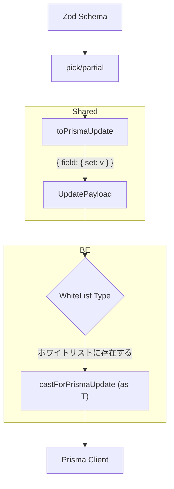

## PrismaUpdate型における 「ホワイトリストキャスティング」

### 課題
* Prismaの型システムは厳格であり、理論上正しいUpdate用の型 ```{ field: { set: value } } 等``` を構築していても、Prisma内部の複雑なUnion型との競合などにより、型不整合が発生する

### 妥協点
* 信頼の外部委託: スキーマでバリデーションと toPrismaUpdate（物理削除・構造変換）を完結させる

* 明示的キャスト: 既に確実に通ることが信頼されたスキーマのみを**ホワイトリスト化**し、例外的にキャストを許可する。

### 実装構造
```ts
/**
 * Zodでパースした後のPayloadを、PrismaのUpdateInputとして安全に扱うための変換器
 * ホワイトリストとして使えるのは動作保証ができているもののみ
 */
type WhiteList =
  | UpdateProjectPayload;

export const castForPrismaUpdate = <T extends Prisma.ProjectUpdateInput>(
  data: WhiteList
): T => {
  // shared の toPrismaUpdate で整形が終わっている前提
  // 論理的な整合性を WhiteList によって保証し、最終的な型不整合を解消する
  return data as T;
};
```

### 特徴
* 簡潔なRepository: Repository内での as 連発を防ぎ、明確な意図を持ったキャスティングのみ受け付ける

* 型安全の維持: リスト外のデータ型は受け付けないため、キャストの乱用を防止できる

* 実利的トレードオフ: ライブラリの仕様に起因する複雑化を避け、テストで保証する。

---

## ホワイトリスト化されたスキーマのフロー

