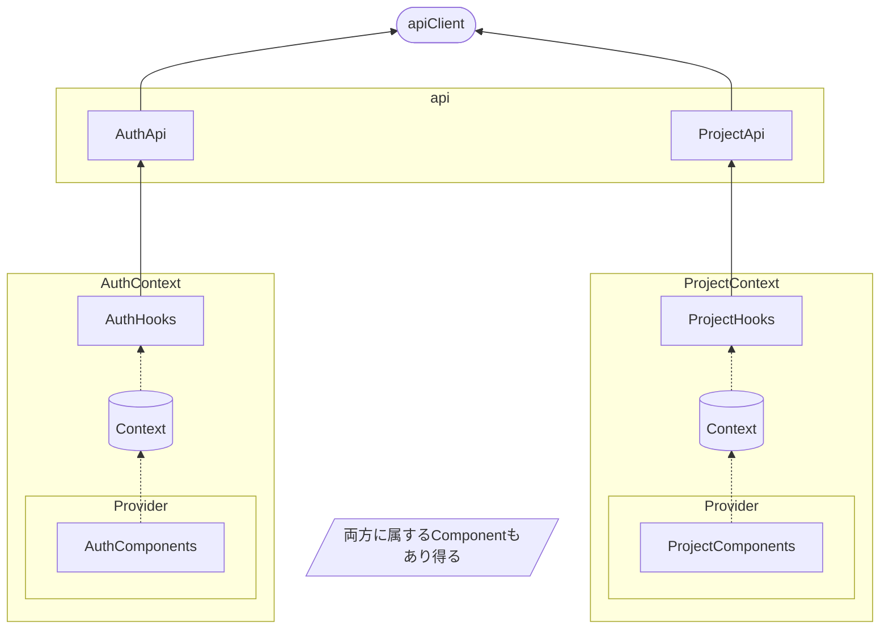

## ・features flow

```mermaid
graph BT
  ApiClient([apiClient])

  AuthApi
  ProjectApi

  subgraph AuthContext
    direction BT

    AuthCtx[(Context)]
    AuthHooks

    subgraph AuthProvider[Provider]
      direction BT

      AuthComponents
    end
  end

  subgraph ProjectContext
    direction BT

    ProjectCtx[(Context)]
    ProjectHooks

    subgraph ProjectProvider[Provider]
      direction BT

      ProjectComponents
    end
  end

  subgraph api
    AuthApi
    ProjectApi
  end


  AuthHooks
  ---> AuthApi

  ProjectHooks
  ---> ProjectApi

  AuthApi & ProjectApi --> ApiClient


  AuthCtx -.-> AuthHooks
  ProjectCtx -.-> ProjectHooks
  AuthComponents -.-> AuthCtx
  ProjectComponents -.-> ProjectCtx

  note[/両方に属するComponentもあり得る/]
```
